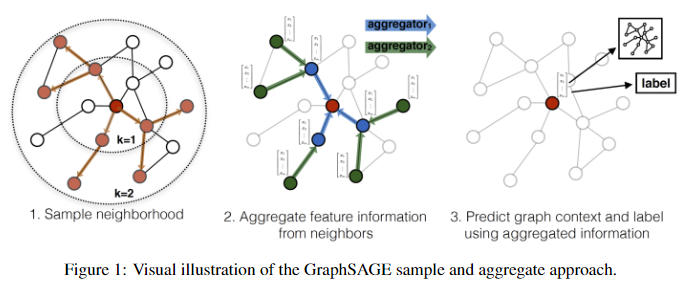
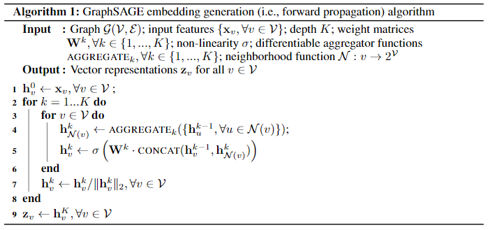
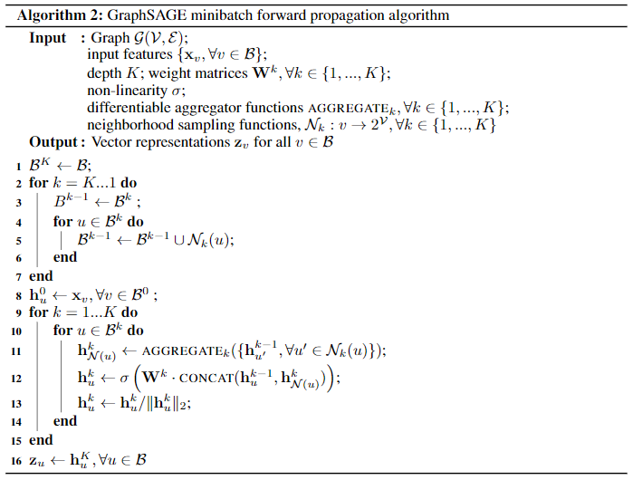
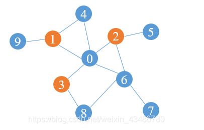
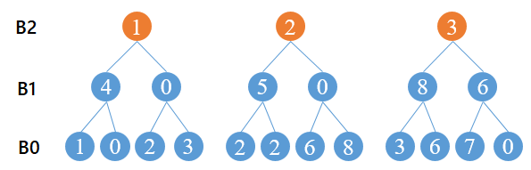

上一篇文章，我们讲了图神经网络：[图卷积神经网络(GCN)理解与tensorflow2.0代码实现](https://blog.csdn.net/VariableX/article/details/109820684)，也提到GCN的缺点：GCN属于直推式学习(Transductive Learning)，它在固定的图上学习每个节点的embedding表示，不能泛化到未加入到图中的节点，一旦图的结构发生改变，就需要重新训练整个网络。

本文提到的 GraphSAGE 属于归纳学习(Inductive Learning)，核心是学习聚合邻居节点信息的函数（聚合函数），然后利用聚合函数来得到一个节点的表示。即使图中加入了新的节点，建立了新的边，那么也可以借助邻居节点信息与聚合函数得到新节点的向量表示。

## 前向传播

下图展示了 GraphSAGE 学习目标节点(中心的红色节点) embedding 的过程：



1. 先对邻居节点采样：上图仅对2跳内的邻居采样，2跳邻居节点采样5个节点，1跳邻居采样个节点。
2. 生成目标节点embedding：先聚合2跳邻居节点特征，生成1跳邻居节点embedding，再聚合1跳邻居节点 embedding，生成目标节点 embedding。
3. 将 embedding 结果作为全连接层输入，预测目标节点标签。

上图展示了GraphSage的两个核心思想：采样(Sample)和聚合(Aggregate)。

整个过程的伪代码（Algorithm 1）如下：



核心部分是第4、5行：

- 第4行：聚合节点 v 的邻居节点(采样后的)在第 $k-1$ 层的 embedding，得到第 $k$ 层的邻居聚合特征 $h_{N(v)}^k$。
- 第5行：将 $h_{N(v)}^k$ 与第 $k-1$ 层节点 $v$ 的 embedding 向量拼接，输入到全连接层后得到节点 $v$ 在第 $k$ 层的 embedding 向量：$h_v^k$。

伪代码中的 K 表示聚合深度，可以理解为要聚合 K 跳邻居节点的信息。

## 聚合函数

在伪代码的第 4 行，使用了聚合函数，由于在图中顶点的邻居是天然无序的，所以我们希望构造出的聚合函数是对称的（即改变输入的顺序，函数的输出结果不变），同时具有较高的表达能力。

作者给出了多种聚合函数：

### 1，平均聚合

也就是Algorithm 1中的聚合方法，对第 k-1 层的邻居embedding中每个维度取平均，然后与目标节点第 k-1 层的embedding拼接后进行非线性转换：
$$
\begin{array}{c}
h_{N(v)}^{k}=\operatorname{mean}\left(\left\{h_{u}^{k-1}, u \in N(v)\right\}\right) \\
h_{v}^{k}=\sigma\left(W^{k} \cdot \operatorname{CONCAT}\left(h_{v}^{k-1}, h_{N(u)}^{k}\right)\right)
\end{array}
$$
### 2，类GCN聚合

直接对目标节点和所有邻居emebdding中每个维度取平均，然后再非线性转换：
$$
h_{v}^{k}=\sigma\left(W^{k} \cdot \operatorname{mean}\left(\left\{h_{v}^{k-1}\right\} \cup\left\{h_{u}^{k-1}, \forall u \in N(v)\right\}\right)\right)
$$
这样的聚合方法与GCN的聚合方式十分相似。

### 3，LSTM 聚合

LSTM 模型对输入数据的表达能力更强，但是LSTM聚合函数不具有对称性，因此在使用时，需要对输入的序列随机打乱顺序。

### 4，Pooling聚合

每个邻居节点的embedding向量都输入到全连接神经网络中，然后对得到的embedding进行 max pooling 操作：
$$
\begin{aligned}
h_{N(v)}^{k-1} &=\max \left(\left\{\sigma\left(W_{\text {pool}} h_{u_i}^{k-1}+b\right)\right\}, \forall u_{i} \in N(v)\right) \\
h_{v}^{k} &=\sigma\left(W^{k} \cdot \operatorname{CONCAT}\left(h_{v}^{k-1}, h_{N(u)}^{k-1}\right)\right)
\end{aligned}
$$

论文中的结果表明LSTM与Pooling聚合的方式要好一些，但是LSTM复杂度过高，因此 Pooling 是比较好的聚合器。作者也给出GraphSage的实践中，K=2，S1*S2<=500就可以达到很高的性能，这说明一般只需要扩展到节点的2阶邻居，每次扩展约20~30个邻居即可。


## 参数的学习

对于无监督学习，我们的学习目标是让相邻的节点拥有相似的向量表示：


其中

- $z_u$是节点 u 通过模型学到的 embedding 
- Q 是采样的样本数量
- $v_n \sim P_n{(u)}$ 表示负采样
- 节点 $v_n$ 是从节点 $u$ 的负采样分布 $P_n$ 中采样的
-  ε 是非常接近0的正数，是为了防止对 0 取对数

如何理解这个损失函数？

先看损失函数的蓝色部分，当节点 u、v 比较接近时，那么其 embedding 向量$z_u, z_v$的距离应该比较近，因此二者的内积应该很大，经过σ函数后是接近1的数，因此取对数后的数值接近于0。

再看看紫色的部分，当节点 u、v 比较远时，那么其 embedding 向量$z_u, z_v$的距离应该比较远，在理想情况下，二者的内积应该是很大的负数，乘上-1后再经过σ函数可以得到接近1的数，因此取对数后的数值接近于0。

对于有监督学习，损失函数就比较常见了，例如交叉熵。

## mini-batch 采样

前面提到的采样算法仅适用于比较小的图，它需要将输入GraphSAGE的数据在整个图中一次性采样好，然后作为一个batch输入到模型中。如果想要对大规模的图进行训练，并且使用随机梯度下降算法进行优化，那么就需要构造 mini-batch 数据作为模型的输入。

由于 mini-batch 中的节点只是图的局部数据，因此采样方法与之前提到的方法略有不同，整体如下图所示：



上图中第 2~7 行是进行mini-batch采样，以 K = 2 为例，最终得到的mini-batch数据有：

- k = 2：$B^{2}$ = [目标节点]
- k = 1：$B^{1}$ = [目标节点 + 一阶邻居]
- k = 0：$B^{0}$ = [目标节点 + 一阶邻居 + 二阶邻居]

再来个更具体的例子，橙色的是目标节点：



则当K=3时，每个mini-batch中的数据如下：



可以看到随着 k 的增大，mini-batch 中的节点数量也是递减的，当 k = K 时，mini-batch 中的数据只剩下我们最终需要计算embedding的目标节点了。反之，当 k = 0 时，mini-batch 中节点的个数最多，因为这里面存放了进行 K 次聚合要到的全部节点。

接下来看看第9~15行，聚合操作是从最外层的多跳邻居开始向内层跳数更少的邻居开始聚合，也就是从上图中的下层向着上层进行聚合：$B^0  \rightarrow B^1\rightarrow B^2$。

这个过程实际上是：

1. 将 k 阶邻居的信息聚合到 k-1 阶的邻居上，
2. 将 k-1 阶邻居的信息聚合到 k-2 阶的邻居上，
3. ......
4. 将 1 阶邻居的信息聚合到目标节点上。

## 代码实现(tensorflow2.0)

### 有监督学习

mini-batch 采样：

```python
# 获得目标节点数据
def _compute_diffusion_matrix(dst_nodes, neigh_dict, sample_size, max_node_id):
    # 对邻居序列采样
    def sample(ns):
        return np.random.choice(ns, min(len(ns), sample_size), replace=False)
    # 邻居序列向量化，得到邻接向量
    def vectorize(ns):
        v = np.zeros(max_node_id + 1, dtype=np.float32)
        v[ns] = 1
        return v

    # 对邻居采样，得到邻接矩阵
    adj_mat_full = np.stack([vectorize(sample(neigh_dict[n])) for n in dst_nodes])
    # 标记哪些列非零，后面用于压缩矩阵
    nonzero_cols_mask = np.any(adj_mat_full.astype(np.bool), axis=0)

    # 压缩矩阵：取出不全为零的列
    adj_mat = adj_mat_full[:, nonzero_cols_mask]
    # 按行求和
    adj_mat_sum = np.sum(adj_mat, axis=1, keepdims=True)
    # 按行归一化
    dif_mat = adj_mat / adj_mat_sum

    # 得到所有目标节点的邻接序号
    src_nodes = np.arange(nonzero_cols_mask.size)[nonzero_cols_mask]
    # 将目标节点与邻接节点取并集，并且升序排序
    dstsrc = np.union1d(dst_nodes, src_nodes)
    # 标记哪些节点是邻接节点
    dstsrc2src = np.searchsorted(dstsrc, src_nodes)
    # 标记哪些节点是目标节点
    dstsrc2dst = np.searchsorted(dstsrc, dst_nodes)

    return dstsrc, dstsrc2src, dstsrc2dst, dif_mat

# 根据节点构造mini-batch数据
def build_batch_from_nodes(nodes, neigh_dict, sample_sizes):
    """
    参数：
    nodes: 目标节点列表
    neigh_dict: 邻居节点列表
    sample_sizes: 每层采样的个数
    """
    # dst_nodes 实际上是栈，存储了0,1,2...,K阶(邻居)节点集合
    dst_nodes = [nodes]
    dstsrc2dsts = []
    dstsrc2srcs = []
    dif_mats = []

    max_node_id = max(list(neigh_dict.keys()))
    """
    以下是mini-batch采样算法,这里以K层为例，说明一下采样顺序与dst_nodes栈内的数据：
    采样顺序是从K，K-1，... 1:
    B_K(栈底元素): 输入目标节点集合nodes；
    B_K-1: 目标节点+其一阶邻居节点；
    B_K-2: 目标节点+其一阶邻居节点+其二阶邻居节点；
    ...
    B_0(栈顶元素): 目标节点+其一阶邻居节点+二阶邻居节点+...+K阶邻居节点。
    """
    for sample_size in reversed(sample_sizes):
        # _compute_diffusion_matrix：
        # 对目标节点dst_nodes[-1]邻居采样sample_size个
        # 当dst_nodes[-1]==nodes时，需要对nodes的邻居
        # ds 是目标节点、邻居节点并集
        # d2s 是ds中邻居节点的序号
        # d2d 是ds中目标节点的序号
        ds, d2s, d2d, dm = _compute_diffusion_matrix ( dst_nodes[-1]
                                                     , neigh_dict
                                                     , sample_size
                                                     , max_node_id
                                                     )
        dst_nodes.append(ds)
        dstsrc2srcs.append(d2s)
        dstsrc2dsts.append(d2d)
        dif_mats.append(dm)

    src_nodes = dst_nodes.pop()
    
    MiniBatchFields = ["src_nodes", "dstsrc2srcs", "dstsrc2dsts", "dif_mats"]
    MiniBatch = collections.namedtuple ("MiniBatch", MiniBatchFields)

    return MiniBatch(src_nodes, dstsrc2srcs, dstsrc2dsts, dif_mats)
```

平均值聚合器：

```python

# 平均值聚合器
class MeanAggregator(tf.keras.layers.Layer):
    def __init__(self, src_dim, dst_dim, activ=True, **kwargs):
        """
        src_dim: 输入维度
        dst_dim: 输出维度
        """
        super().__init__(**kwargs)
        self.activ_fn = tf.nn.relu if activ else tf.identity
        self.w = self.add_weight( name = kwargs["name"] + "_weight"
                                , shape = (src_dim*2, dst_dim)
                                , dtype = tf.float32
                                , initializer = init_fn
                                , trainable = True
                                )
    
    def call(self, dstsrc_features, dstsrc2src, dstsrc2dst, dif_mat):
        """
        dstsrc_features: 第 K-1 层所有节点的 embedding
        dstsrc2dst: 当前层的目标节点
        dstsrc2src: 当前层的邻居节点
        dif_mat: 归一化矩阵
        """
        # 从当前batch所有节点中取出目标节点
        dst_features = tf.gather(dstsrc_features, dstsrc2dst)
        # 从当前batch所有节点中取出邻居节点
        src_features = tf.gather(dstsrc_features, dstsrc2src)
        # 对邻居节点加权求和，得到邻居节点embedding之和的均值
        # (batch_size, num_neighbors) x (num_neighbors, src_dim)
        aggregated_features = tf.matmul(dif_mat, src_features)
        # 将第k-1层的embedding与聚合结果进行拼接
        concatenated_features = tf.concat([aggregated_features, dst_features], 1)
        # 乘上权重矩阵 w 
        x = tf.matmul(concatenated_features, self.w)
        return self.activ_fn(x)

```

有监督 GraphSage 模型：

```python

class GraphSageBase(tf.keras.Model):

    def __init__(self, raw_features, internal_dim, num_layers, last_has_activ):

        assert num_layers > 0, 'illegal parameter "num_layers"'
        assert internal_dim > 0, 'illegal parameter "internal_dim"'

        super().__init__()

        self.input_layer = RawFeature(raw_features, name="raw_feature_layer")

        self.seq_layers = []
        for i in range (1, num_layers + 1):
            layer_name = "agg_lv" + str(i)
            input_dim = internal_dim if i > 1 else raw_features.shape[-1]
            has_activ = last_has_activ if i == num_layers else True
            aggregator_layer = MeanAggregator ( input_dim
                                              , internal_dim
                                              , name=layer_name
                                              , activ = has_activ
                                              )
            self.seq_layers.append(aggregator_layer)

    def call(self, minibatch):
        # 取出当前batch中用到的所有节点
        x = self.input_layer(tf.squeeze(minibatch.src_nodes))
        for aggregator_layer in self.seq_layers:
            # 逐层聚合
            x = aggregator_layer ( x
                                 , minibatch.dstsrc2srcs.pop()
                                 , minibatch.dstsrc2dsts.pop()
                                 , minibatch.dif_mats.pop()
                                 )
        return x # shape: (batch_size, src_dim)

class GraphSageSupervised(GraphSageBase):
    def __init__(self, raw_features, internal_dim, num_layers, num_classes):
        super().__init__(raw_features, internal_dim, num_layers, True)
        self.classifier = tf.keras.layers.Dense ( num_classes
                                                , activation = tf.nn.softmax
                                                , use_bias = False
                                                , kernel_initializer = init_fn
                                                , name = "classifier"
                                                )

    def call(self, minibatch):
        return self.classifier( super().call(minibatch) )
```

### 无监督学习

mini-batch 采样：

```python

def _get_neighbors(nodes, neigh_dict):
    return np.unique(np.concatenate([neigh_dict[n] for n in nodes]))

# 无监督学习时，根据边得到 mini-batch 数据
def build_batch_from_edges(edges, nodes, neigh_dict, sample_sizes, neg_size):
    # batchA 目标节点列表
    # batchB 与目标节点对应的邻居节点列表
    batchA, batchB = edges.transpose()
    # 从 nodes 中去除 batchA、batchA节点邻居，batchB、batchB节点邻居
    # 执行过程：((((nodes-batchA)-neighbor_A)-batchB) - neighbor_B)
    # 得到所有可能的负样本
    possible_negs = reduce ( np.setdiff1d
                           , ( nodes
                             , batchA
                             , _get_neighbors(batchA, neigh_dict)
                             , batchB
                             , _get_neighbors(batchB, neigh_dict)
                             )
                           )
    # 从所有负样本中采样出neg_size个
    batchN = np.random.choice ( possible_negs
                              , min(neg_size, len(possible_negs))
                              , replace=False
                              )

    # np.unique：去重，结果已排序
    batch_all = np.unique(np.concatenate((batchA, batchB, batchN)))
    # 得到batchA、batchB在batch_all中的序号
    dst2batchA = np.searchsorted(batch_all, batchA)
    dst2batchB = np.searchsorted(batch_all, batchB)
    # 计算batch_all每个元素在batchN中是否出现
    dst2batchN = np.in1d(batch_all, batchN)
    # 上面已经完成了边的采样，并且得到边的节点
    # 接下来是构造mini-batch数据
    minibatch_plain = build_batch_from_nodes ( batch_all
                                             , neigh_dict
                                             , sample_sizes
                                             )

    MiniBatchFields = [ "src_nodes", "dstsrc2srcs", "dstsrc2dsts", "dif_mats"
                      , "dst2batchA", "dst2batchB", "dst2batchN" ]
    MiniBatch = collections.namedtuple ("MiniBatch", MiniBatchFields)

    return MiniBatch ( minibatch_plain.src_nodes # 目标节点与邻居节点集合
                     , minibatch_plain.dstsrc2srcs # 邻居节点集合
                     , minibatch_plain.dstsrc2dsts # 目标节点集合
                     , minibatch_plain.dif_mats # 归一化矩阵
                     , dst2batchA # 随机采样边的左顶点
                     , dst2batchB # 随机采样边的右顶点
                     , dst2batchN # 标记是否为负采样节点的mask
                     )
```

无监督损失函数：

```python

# 无监督学习的损失函数
@tf.function 
def compute_uloss(embeddingA, embeddingB, embeddingN, neg_weight):
    # 计算边的两个节点的内积，得到相似度
    # (batch_size, emb_dim) * (batch_size, emb_dim) 
    # -> (batch_size, emb_dim) -> (batch_size, )
    pos_affinity = tf.reduce_sum ( tf.multiply ( embeddingA, embeddingB ), axis=1 )
    # 相当于每个节点都和负样本的 embedding 计算内积，
    # 得到每个节点与每个负样本的相似度
    # (batch_size, emb_dim) x (emb_dim, neg_size) -> (batch_size, neg_size)
    neg_affinity = tf.matmul ( embeddingA, tf.transpose ( embeddingN ) )
    # shape: (batch_size, )
    pos_xent = tf.nn.sigmoid_cross_entropy_with_logits ( tf.ones_like(pos_affinity)
                                                       , pos_affinity
                                                       , "positive_xent" )
    # shape: (batch_size, neg_num)
    neg_xent = tf.nn.sigmoid_cross_entropy_with_logits ( tf.zeros_like(neg_affinity)
                                                       , neg_affinity
                                                       , "negative_xent" )
    # 对neg_xent所有元素求和后乘上权重
    weighted_neg = tf.multiply ( neg_weight, tf.reduce_sum(neg_xent) )
    # 对两个 loss 进行累加
    batch_loss = tf.add ( tf.reduce_sum(pos_xent), weighted_neg )

    # loss 除以样本个数
    return tf.divide ( batch_loss, embeddingA.shape[0] )
```

无监督 GraphSage 模型：

```python
class GraphSageUnsupervised(GraphSageBase):
    def __init__(self, raw_features, internal_dim, num_layers, neg_weight):
        super().__init__(raw_features, internal_dim, num_layers, False)
        self.neg_weight = neg_weight

    def call(self, minibatch):
        # 对 embedding 结果进行正则化
        embeddingABN = tf.math.l2_normalize(super().call(minibatch), 1)
        # 损失函数的计算
        self.add_loss (
                compute_uloss ( tf.gather(embeddingABN, minibatch.dst2batchA)
                              , tf.gather(embeddingABN, minibatch.dst2batchB)
                              , tf.boolean_mask(embeddingABN, minibatch.dst2batchN)
                              , self.neg_weight
                              )
                )
        return embeddingABN
```


参考文章：

[GraphSAGE: GCN落地必读论文](https://zhuanlan.zhihu.com/p/62750137)

[OhMyGraphs: GraphSAGE and inductive representation learning](https://medium.com/analytics-vidhya/ohmygraphs-graphsage-and-inductive-representation-learning-ea26d2835331)

[全面理解PinSage](https://zhuanlan.zhihu.com/p/133739758)

[GraphSAGE论文总结及源码解读](https://blog.csdn.net/weixin_43486780/article/details/104268931)

[https://github.com/subbyte/graphsage-tf2](https://github.com/subbyte/graphsage-tf2)